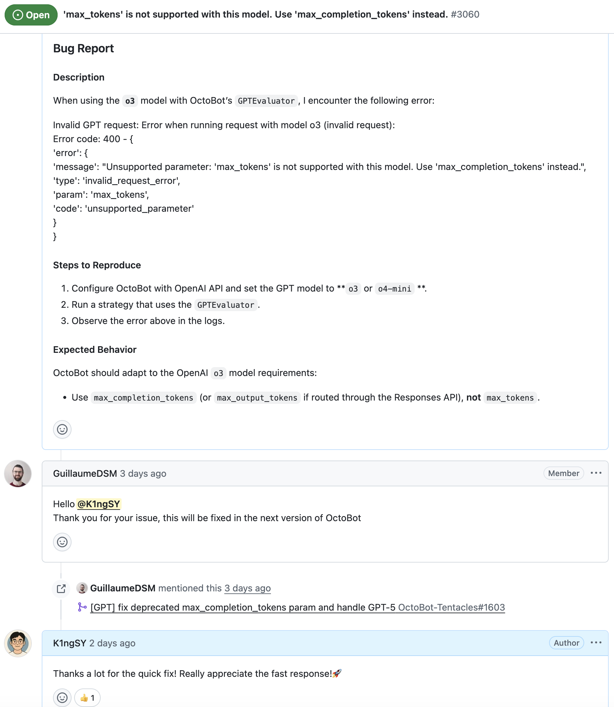

+++
date = '2025-09-03T18:40:10-07:00'
draft = false
title = 'Awesome GitHub Projects'
description = "A curated collection of interesting and high-quality projects I discovered on GitHub."
summary = "Showcasing inspiring open-source work that caught my attention on GitHub."
tags = ["open-source", "posts"]
+++

# Awesome GitHub Projects 🚀

This page is dedicated to showcasing interesting, inspiring, or technically impressive projects I’ve discovered on GitHub.  
Each entry follows a simple format for consistency.

---

### 📌 Project: [OctoBot](https://github.com/Drakkar-Software/OctoBot)

**Description:**  
OctoBot is an open-source cryptocurrency trading bot designed to provide flexible, automated trading strategies. It supports multiple exchanges, offers backtesting capabilities, and enables both beginners and advanced users to experiment with algorithmic trading.  

**Why It’s Interesting:**  
OctoBot stands out because it integrates AI-powered prediction models into trading strategies. Most notably, it allows users to connect to **custom LLMs** via a configurable base URL—making it possible to use alternatives beyond OpenAI models. This flexibility includes support for local AI setups like **Ollama**, which means traders can experiment with running their own prediction models locally. Such extensibility opens the door to more privacy, cost efficiency, and creativity in designing AI-driven trading systems.  

**Tech Stack:**  
- Languages: Python  
- Tools: Docker, AsyncIO, WebSocket, REST APIs  

**Key Features:**  
- Custom **LLM base URL** for predictions (connect to any AI model, not only OpenAI)  
- Seamless integration with **Ollama** for local LLM trading predictions  
- Multi-exchange support with real-time market data  
- Strategy customization with backtesting and simulation  
- Active open-source community and continuous development  

**My contribution:**

<!-- ## Template for Each Project

### 📌 Project: [Project Name](https://github.com/username/repo)

**Description:**  
_A short summary of what this project does (2–3 sentences)._

**Why It’s Interesting:**  
_A brief note on why I found this project valuable or inspiring (e.g., unique idea, strong technical implementation, great documentation, etc.)._

**Tech Stack:**  
- Language(s):  
- Framework/Tools:  

**Key Features:**  
- Feature 1  
- Feature 2  
- Feature 3  

---

## Example (Placeholder)

### 📌 Project: [Example Project](https://github.com/example/example)

**Description:**  
This is a placeholder project description. It explains what the project does in a concise way.  

**Why It’s Interesting:**  
I found it inspiring because of its elegant implementation and practical use case.  

**Tech Stack:**  
- Languages: Python, JavaScript  
- Tools: Docker, Flask  

**Key Features:**  
- Clean architecture  
- Great documentation  
- Active community support -->