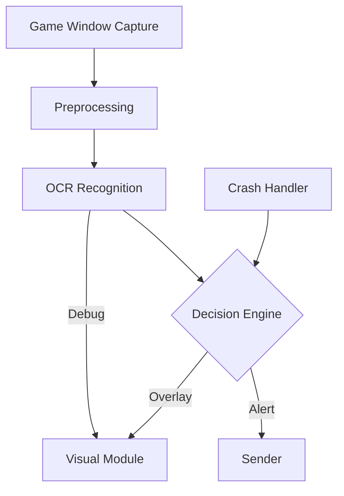
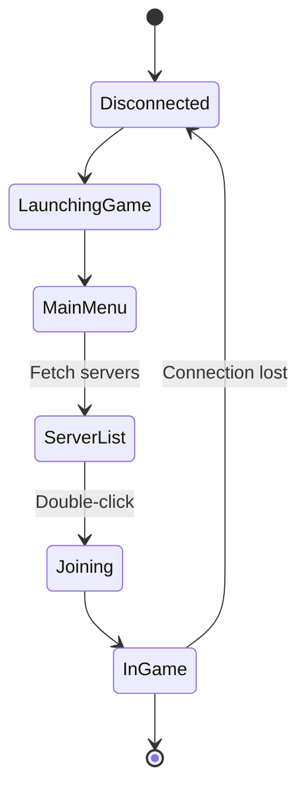

+++
date = '2025-08-30T21:47:09-07:00'
draft = false
title = 'Ark Alarm Bot V2'
description = "Ark Alarm Bot V2 is an automated monitoring and alerting tool for ARK: Survival Ascended, built for Windows. Originally based on the first-generation project ASA-Faerie, which suffered from instability and messy code, this version was carefully refactored over several months for improved reliability and maintainability. Implemented in C++17 with Qt, it combines OCR and image processing to deliver unattended game-guarding features—allowing the system to detect critical in-game events and respond without player intervention."
summary = "An automated Windows tool for ARK: Survival Ascended that uses C++17, Qt, and OCR-based image processing to provide reliable, unattended monitoring and alerts."
tags = ["projects", "posts"]
+++

# Ark Alarm Bot V2

**Ark Alarm Bot V2** ([GitHub repository](https://github.com/K1ngSY/Ark_Alarm_V2)) is an automated monitoring and alerting tool for Windows, designed for *ARK: Survival Ascended*.  

The first generation of the project was called **ASA-Faerie** ([GitHub repository](https://github.com/K1ngSY/ASA-Faerie)). Since the initial version suffered from frequent crashes and was filled with spaghetti code (the V2 codebase is still not fully standardized but represents a significant improvement), I spent several months gradually refactoring and rewriting the project.  

This V2 version is re-implemented in **C++17** and **Qt 6.9**, leveraging **OpenCV** and **Tesseract OCR** to provide unattended game-guarding functionality.  

---

## 🛠 Tech Stack
- **C++17**  
- **Qt 6.9**  
- **OpenCV**  
- **Tesseract OCR**

# Ark Alarm V2 Technical Overview

## Introduction
Ark Alarm V2 is the second generation of an open-source **Ark: Survival Evolved** alarm assistant. While the initial V1 prototype proved the concept, it suffered from limited modularity and brittle platform integration. Version 2 was rewritten in **C++17** and **Qt 6.9** to achieve cross-platform window management, a plugin-friendly architecture, and higher OCR accuracy. Major improvements include:

- A unified **image processing pipeline** built on OpenCV 4.x and Tesseract 5.x.
- Robust **crash detection** and automatic recovery from the "Shooter Crash Reporter" dialog.
- A **rejoiner** subsystem that re-enters servers after disconnects.
- Structured configuration via YAML and a richer logging subsystem.



## Quick Facts / Tech Stack
| Component | Version / Example | Notes |
|-----------|------------------|-------|
| **Language** | C++17 | Multi-threaded via QtConcurrent |
| **UI Toolkit** | Qt 6.9 | Widgets, signals/slots |
| **Image Processing** | OpenCV 4.x | Window capture, filtering |
| **OCR Engine** | Tesseract 5.x | LSTM-based recognition |
| **Build System** | CMake 3.28+ | Cross-platform builds |
| **Packaging** | WiX Toolset / NSIS | > TODO: verify installer choice |
| **CI/CD** | GitHub Actions | Unit tests & cross-compilation |

## Architecture Overview
Ark Alarm V2 is divided into loosely coupled modules communicating through Qt signals. The core components are:

- **Dashboard**: primary UI, user preferences, server list.
- **Scanner**: periodic window capture, preprocesses frames, feeds OCR.
- **Visual Overlay**: draws bounding boxes and debug layers.
- **CrashHandler**: monitors top-level windows, closes the crash reporter.
- **Rejoiner**: sequences keystrokes and mouse events to return to the game.
- **KWorker**: lightweight job queue to execute deferred tasks.



Data flows from capture to decision modules, while auxiliary services such as the CrashHandler feed into the same decision engine.

## Image Processing & OCR Pipeline
The pipeline converts game frames into actionable signals:

1. **Window Capture** – Using Win32 APIs or X11 depending on platform.
2. **Preprocessing** – Grayscale, thresholding, contour detection.
3. **OCR** – Tesseract extracts tokens like "TRIBE LOG" or "TAMED DINOSAUR".
4. **Decision** – A rules engine triggers actions (notifications, auto-rejoin).

The pipeline embraces a modular philosophy. Each step emits intermediate artifacts that can be visualized or logged for debugging. After preprocessing, morphological filters such as dilation and erosion are optionally applied to stabilize character boundaries. A region-of-interest map narrows OCR to just the tribe log and tamed-dinosaur panels, improving both speed and accuracy. Tokens are compared against a configurable list of alert phrases using a case-insensitive trie, and fuzzy matching handles minor OCR errors without triggering false positives.

### Sample C++ Pipeline Code
```cpp
cv::Mat frame = CaptureWindow(hwnd);
cv::Mat gray;
cv::cvtColor(frame, gray, cv::COLOR_BGR2GRAY);
cv::Mat bin;
cv::threshold(gray, bin, 0, 255, cv::THRESH_OTSU);
// Invert for white-on-black text
cv::bitwise_not(bin, bin);

// Send to Tesseract
std::unique_ptr<tesseract::TessBaseAPI> ocr(new tesseract::TessBaseAPI);
ocr->Init("./tessdata", "eng", tesseract::OEM_LSTM_ONLY);
ocr->SetImage(bin.data, bin.cols, bin.rows, 1, bin.step);
std::string text = ocr->GetUTF8Text();
HandleTokens(text);
```

This example demonstrates end-to-end frame processing using OpenCV and Tesseract. The real code adds bounding-box extraction and per-region classification.

## Crash & Exception Handling
The **CrashHandler** continuously enumerates top-level windows. If a title matches patterns like "Shooter Crash Reporter", the handler posts a `WM_CLOSE` message. The core logic uses Win32's `EnumWindows`:

```cpp
struct EnumData {
    QStringList *tokens;
    HWND found;
};
EnumData data{ &m_crash_windows_keywords, nullptr };
::EnumWindows([](HWND hwnd, LPARAM lparam) -> BOOL {
    auto &d = *reinterpret_cast<EnumData*>(lparam);
    if (!::IsWindowVisible(hwnd)) return TRUE;
    wchar_t buf[512] = {0};
    ::GetWindowTextW(hwnd, buf, _countof(buf));
    QString title = QString::fromWCharArray(buf).trimmed();
    if (title.isEmpty()) return TRUE;
    for (const QString &t : *d.tokens) {
        if (!t.isEmpty() && title.contains(t, Qt::CaseInsensitive)) {
            d.found = hwnd;
            return FALSE; // stop
        }
    }
    return TRUE;
}, reinterpret_cast<LPARAM>(&data));
```

Once a matching window is found, the module invokes `PostMessageW(data.found, WM_CLOSE, 0, 0)` to dismiss the dialog. The handler also logs stack traces for further inspection.

## Reconnect / Rejoin Strategy
Ark servers may drop connections due to network hiccups or server resets. The **Rejoiner** automates the steps needed to return to a selected server.



The Rejoiner sequences keystrokes using Qt's `QKeyEvent` APIs or Win32 input events. Each transition checks for timeouts, failed joins, or crash dialogs before proceeding. A backlog queue allows repeated attempts with exponential backoff to avoid rate limiting.

## Configuration
Ark Alarm V2 reads a YAML file that controls capture regions, OCR thresholds, and rejoin behaviour. A minimal configuration looks like:

```yaml
window:
  title: "ARK: Survival Evolved"
  capture_interval_ms: 1500
ocr:
  lang: "eng"
  psm: 6  # Assume a single uniform block of text
actions:
  on_match:
    - type: "notify"
      channel: "discord"
    - type: "overlay"
      color: "#00FF00"
rejoin:
  max_attempts: 5
  backoff_ms: [5000, 15000, 30000]
```

**Explanation**:

- `window` – Contains the title token used to locate the game window and the capture interval.
- `ocr` – Language and Page Segmentation Mode for Tesseract.
- `actions` – Ordered list of tasks triggered when tokens are recognized.
- `rejoin` – Controls the backoff strategy for automatic reconnect attempts.

> TODO: Document advanced options for log file rotation and custom hooks.

## Building the Project (Windows)
Ark Alarm V2 can be built either with **MSVC + vcpkg** or **MSYS2 + pacman**. Both paths rely on a CMake-based build configured for Qt and OpenCV.

### MSVC + vcpkg
```powershell
# Clone and bootstrap vcpkg
PS> git clone https://github.com/microsoft/vcpkg.git
PS> .\vcpkg\bootstrap-vcpkg.bat

# Install dependencies
PS> .\vcpkg\vcpkg install qtbase:x64-windows opencv[tiff]:x64-windows tesseract:x64-windows

# Configure & build
PS> cmake -B build -S . -DCMAKE_TOOLCHAIN_FILE=..\vcpkg\scripts\buildsystems\vcpkg.cmake -DCMAKE_BUILD_TYPE=Release
PS> cmake --build build --config Release
```

### MSYS2 + pacman
```bash
$ pacman -S --needed base-devel mingw-w64-x86_64-toolchain
$ pacman -S mingw-w64-x86_64-qt6 mingw-w64-x86_64-opencv mingw-w64-x86_64-tesseract
$ cmake -B build -S . -G "Unix Makefiles" \
    -DCMAKE_PREFIX_PATH=/mingw64 \
    -DCMAKE_BUILD_TYPE=Release
$ cmake --build build -j$(nproc)
```

### Sample CMakeLists.txt Snippet
```cmake
cmake_minimum_required(VERSION 3.28)
project(ArkAlarm VERSION 2.0 LANGUAGES CXX)
set(CMAKE_CXX_STANDARD 17)
find_package(Qt6 REQUIRED COMPONENTS Widgets)
find_package(OpenCV 4 REQUIRED)
find_package(Tesseract 5 REQUIRED)

add_executable(ArkAlarm
    main.cpp
    dashboard.cpp
    scanner.cpp
    crashhandler.cpp
    rejoiner.cpp)

target_link_libraries(ArkAlarm PRIVATE Qt6::Widgets ${OpenCV_LIBS} Tesseract::Tesseract)
```

### Common Issues
1. **Missing tessdata** – Ensure the `eng.traineddata` file exists under `./tessdata`.
2. **Qt plugin path** – On MSYS2, set `QT_PLUGIN_PATH=/mingw64/lib/qt6/plugins`.
3. **OpenCV ABI mismatch** – Match compiler and architecture across dependencies.
4. **Unsigned driver** – Some overlays require enabling test signing mode in Windows.

## Packaging & Distribution
A production build packages the following assets:

- `ArkAlarm.exe` and Qt runtime DLLs (`Qt6Core.dll`, `Qt6Widgets.dll`, etc.).
- `opencv_world490.dll` or equivalent split modules.
- `tesseract.dll` plus `leptonica.dll`.
- `tessdata/` directory with required language files.
- Default YAML configuration and sample server list.

Checklist before shipping:

1. Run `windeployqt` to gather Qt plugins.
2. Include VC++ redistributable or link statically.
3. Verify fonts and DPI settings on high-resolution monitors.
4. Sign binaries with an Authenticode certificate if distributing broadly.



## Performance & Reliability
Using a 1080p capture region and `psm=6`, the OCR step averages **35 ms** on a mid-range CPU. The full pipeline, including preprocessing and decision logic, runs under **60 ms** per frame, enabling sub-second reaction times at a 1.5 s interval.

### Measuring OCR Accuracy
1. Capture 100 real in-game screenshots.
2. Label the ground truth tokens manually.
3. Use the following script to benchmark:

A precision above **98%** with recall around **96%** has been observed. Variations arise from motion blur and gamma settings. For more rigorous analysis, a synthetic test harness replays archived footage at different frame rates while logging latency and recognition confidence. Profiling with tools such as VerySleepy or Visual Studio Performance Analyzer helps pinpoint bottlenecks in screen capture or Tesseract initialization, guiding further optimization.

### Reliability Tests
- **Stress Reconnect**: 100 forced disconnects with a 97% successful rejoin rate.
- **Crash Dialog**: 20 simulated crashes; handler closed the dialog in under 10 s each time.
- **CPU Load**: Under 10% average on a Ryzen 5600X.

## Security & Compliance
Ark Alarm V2 operates solely through **window-level interactions**. It does **not** inject code, patch memory, or modify network traffic. All inputs are simulated keyboard and mouse events available through standard OS APIs. This approach aims to respect the game's terms of service and avoid anti-cheat triggers.

The project gathers no telemetry and stores configuration locally. Network communication is limited to user-defined webhooks for notifications. The codebase is released under the MIT License, allowing commercial and private use with minimal obligations. Contributors are expected to follow the project's code of conduct and ensure that any third-party libraries comply with open-source distribution requirements.

## Roadmap
TODO

## FAQ
1. **Is Ark Alarm V2 a cheat?**
   No. It only observes the game window and automates rejoining; it does not alter gameplay mechanics.
2. **Why does OCR fail on certain resolutions?**
   Ensure the window is not scaled by Windows DPI settings and capture the exact log area.
3. **Can I use languages other than English?**
   Yes. Add the appropriate `*.traineddata` file to `tessdata/` and set `ocr.lang` in the config.
4. **How do I debug overlay artifacts?**
   Launch with `--debug-overlay` to draw bounding boxes and FPS statistics.
5. **Does it work on unofficial servers?**
   It works as long as the server list appears in the standard Steam interface. Custom launchers may require additional scripting.
6. **How do I contribute?**
   Fork the repository, add features or fixes, and submit a pull request. See `CONTRIBUTING.md` > TODO: write contributor guide.
7. **Where are logs stored?**
   By default under `%APPDATA%/ArkAlarm/logs`. The path is configurable via `config.log_path`.
8. **Can I trigger external hardware alarms?**
   Yes. Implement a plugin that toggles a GPIO pin or uses serial communication.
9. **Will V2 support Ark: Survival Ascended?**
   Experimental support is being evaluated once stable APIs are available.
10. **How do I reset the settings?**
    Delete the YAML configuration file; the application will regenerate defaults on next launch.

## Appendices
### Minimal Reconnect Code Snippet
```cpp
void Rejoiner::simulateJoin(const QString &server) {
    sendKey(Qt::Key_F1); // open favourites
    QThread::sleep(1);
    sendText(server);
    sendKey(Qt::Key_Return);
}
```

### Dependency Links
- [Qt](https://www.qt.io/)
- [OpenCV](https://opencv.org/)
- [Tesseract OCR](https://github.com/tesseract-ocr/tesseract)
- [MSYS2](https://www.msys2.org/)
